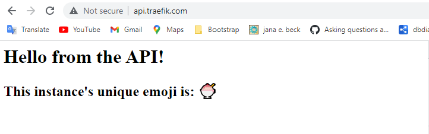
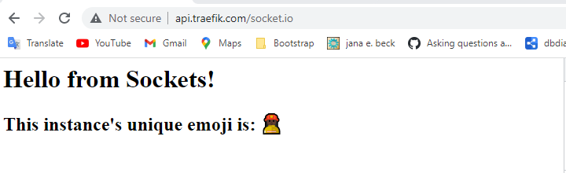
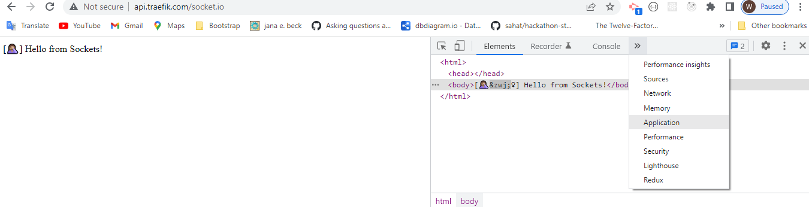
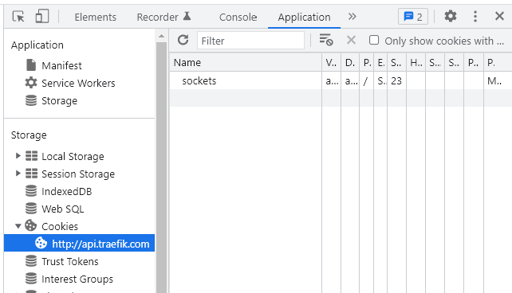
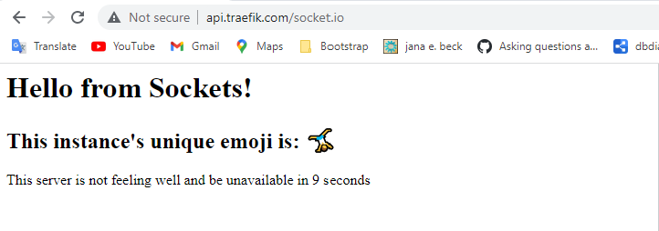
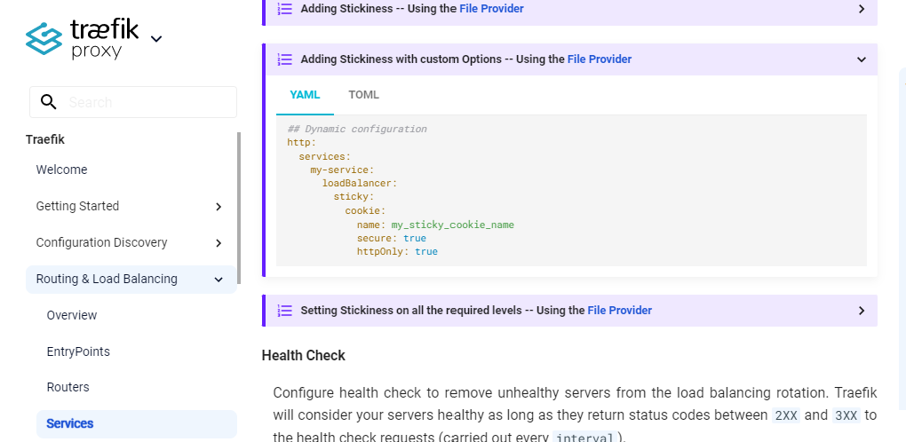

# Traefik with Stickyness
This repository is an example of using traefik to serve requests to two small express servers who can be resolved at the same DNS but differentiated by their `/path` with different loadbalancing requirements (api is round-robin, sockets have sticky sessions enabled)

# Installation
1. Clone the repo.
    ```
    git clone git@github.com:wannabewayno/traefik-example.git && cd traefik-example
    ```

2. Next add an entry to your machine's host file to resolve `api.traefik.com => localhost`
   - **Linux**
        ```
        sudo bash -c 'echo -e "\n# Added by Traefik Example\n127.0.0.1\ttraefik.com\tapi.traefik.com\n# End of section" >> /etc/hosts'
        ```
   - **Windows** (Powershell as Administrator)
        ```
        Add-Content C:\Windows\System32\Drivers\etc\hosts "`n# Added by Traefik Example`n127.0.0.1`ttraefik.com`tapi.traefik.com`n"
        ```

   - **MacOS**
        ```
        sudo bash -c 'echo -E "\n# Added by Traefik Example\n127.0.0.1\ttraefik.com\tapi.traefik.com\n# End of section" >> /etc/hosts'
        ```

3. Start your engines.
    ```
    docker compose up
    ```

# What's goin on?
We've defined the loadbalancing configuration entirely through labels in the `docker-compose.yml`. So pull this up to follow along.

The basic express servers when hit have been designed to show a unique random emoji and the name of the service (api or sockets) so you can tell the difference between the service and the instance of the service you're hitting.

The compose file scales the API service to 3 replicas and the sockets to 6 replicas.
To test if everything is working correctly follow these steps.

## api service
The api service should be accessible by simply hitting `api.traefik.com` in your browser.

You should see something like.


Hit `crtl + r` to refresh.\
You should see a different emoji. This means that traefik is load-balancing your requests to the api service.

If you hit `crtl + r` again then you should see a different emoji.

If you do another refresh, you should see the original emoji you started off with as the api service only has three instances to balance requests to.

If all of this works, then the service is working as intended!

## socket service
The socket service has an extra layer of configuration where
- **We only push requests to this service if the user goes to `api.traefik.com/socket.io`**\
  This is set using a label on the service to set a router rule that traefik uses for configuration.
  ```
  "traefik.http.routers.socket.rule=Host(`api.traefik.com`) && Path(`/socket.io`)"
  ```
  It should be obvious that requests will be routed to this service if the host equals 'api.traefik.com' AND and the path equals '/socket.io'.

- **Requests will be "sticky"**\
    This means that a cookie will set on the response that identifies the original socket instance that this user first connected to. Subsequent requests to the socket service will always route this user to the same instance.

To check if this is working correctly head on over to `api.traefik.com/socket.io` and you should see something like.


Next hit `crtl + r`, and you **should not** see a change!\
This means that this service is working correctly as it has remembered where you came from and keeps routing you back there!

To see this in action, open your browsers dev tools and go to application > cookies for `api.traefik.com`


You should see the aptly name `socket` cookie. This is the thing that tells the sorting hat which house to put you in (i.e not slytherin).



If you delete this cookie (select it and click on the little cross) and refresh the page `crlt + r` then you should see a different emoji! As we have 6 socket instances to be routed to, if you then refresh again, it should stay the same that darn cookie should be back!

## Healthchecks
You might notice console.logs for "Healthcheck recieved!" after your docker compose command. This is the loadbalancer checking to see if your instances are working properly. When stickiness is enabled and a cookie tries to direct a request to a unhealthy service instance, it will intercept the request and re-route the user to a healthy instance instead and re-set the cookie to target you back to this healthy instance.

To try this out, export this environment variable.
```
export SIMULATE_UNHEALTHY_SERVERS=true
```

And restart the traefik example by `crtl + c` out of the docker compose and starting it up again.

All instances are now randomly 'unstable' which simply means that they will be periodically giving the loadbalancer some 504's on the healthcheck route to mark it as unhealthy.

Now when you go to `api.traefik.com/socket.io` you should see a different message that let's you know the server is unhealthy and won't be available soon.


Keep hitting `crlt + r` to see the timer countdown and when it gets close to zero you should be routed to a server that isn't down yet. Hit refresh again and you will stay there until this server is also down.

## Wrapping up
I hope that by inspecting the docker-compose.yml file you can see how these rules have been setup and can get a feel for how they work.

I built this example purely from the [traefik documentation](https://doc.traefik.io/traefik/routing/services/). It's worth noting that the docs aren't that friendly however I found that anything they put in a yaml file, you can use dot notation to explain on a label and pass through with flags on the `command` section of the compose service.

For example, here's a screenshot for setting up stickiness in a configuration file.

This means placing this somewhere in a configuration file.
```
## Dynamic configuration
http:
  services:
    my-service:
      loadBalancer:
        sticky:
          cookie:
            name: my_sticky_cookie_name
            secure: true
            httpOnly: true
```

However I found I could simply pass this through as labels in the docker compose file like
```
labels:
- "https.services.my-service.loadBalancer.sticky.cookie.name=my_sticky_cookie_name
- "https.services.my-service.loadBalancer.sticky.cookie.secure=true
- "https.services.my-service.loadBalancer.sticky.cookie.httpOnly=true
```

And that's it!